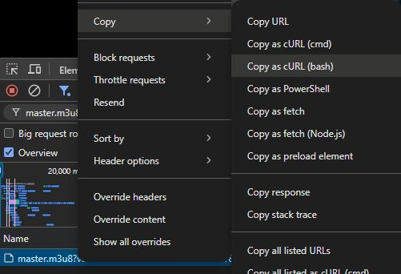

# hls_dl

An HLS (HTTP Live Streaming) downloader built with TypeScript / Node.js. It reads a cURL command copied from your browser straight from the clipboard, downloads the m3u8 stream (including encryption keys and separate audio tracks), and can merge everything into an MP4 via ffmpeg.

## Features

- **Clipboard as input**: "Copy as cURL" in your browser's devtools and just run — no need to manually extract URLs or headers
- **Automatic cURL script parsing**: extracts the URL, headers (`-H`) and cookies (`-b`) to faithfully replay the browser request
- **Master / media playlists**: picks the preferred bandwidth (high/low), downloads video and separate audio tracks
- **Encrypted streams**: downloads `EXT-X-KEY` keys and `EXT-X-MAP` initialization segments
- **Multi-threaded downloads**: configurable concurrency; already-downloaded segments are skipped (resumable)
- **Two download engines**: axios by default, or the system cURL
- **One-step MP4 conversion**: merges with ffmpeg after downloading (stream copy, no re-encoding)

## Requirements

- Node.js (18+ recommended)
- [ffmpeg](https://ffmpeg.org/) (optional, for MP4 conversion; must be in `PATH`)

## Installation & Build

```bash
npm install
npm run build
```

The build output goes to `dist/`; once installed, the `hls_dl` command is available.

## Usage

### Copy HLS URL to clipboard

Open the video page in Chrome and press F12 to open DevTools. In the **Network** panel, find the `.m3u8` request, right-click it and choose **Copy → Copy as cURL (bash)** from the context menu:



Then run the downloader (the script is read directly from the clipboard):

```bash
# Development mode
npx ts-node src/index.ts

# Or after building
hls_dl
```

### Command-line Options

| Option | Description |
| --- | --- |
| `-c, --clear` | Clear the previous download job (working directory) |
| `-C, --curl` | Use system cURL for downloading (default: axios) |
| `-s, --script <file>` | Read the cURL script from a file (default: clipboard) |
| `-b, --bandwidth <l\|h>` | Bandwidth selection: `l` (low) or `h` (high) (default: `h`) |
| `-t, --thread <count>` | Number of download threads (default: 1) |
| `-v, --verbose` | Enable verbose logging |
| `-h, --help` | Show the help message |

### Examples

```bash
# After copying the HLS URL to the clipboard, download with 8 threads and low bandwidth
npx ts-node src/index.ts -t 8 -b l

# Read the cURL script from a file and download with system curl
npx ts-node src/index.ts -s download.sh -C

# Resume an interrupted download (the script is kept in the working
# directory; just re-run — downloaded segments are skipped)
npx ts-node src/index.ts
```

## How It Works

1. Reads the cURL script from a file / the working directory / the clipboard, and saves it to `.hls_dl/download.sh`;
2. Downloads the master m3u8 playlist using the URL and headers from the script;
3. Parses the playlist and downloads the video (and audio) media playlists at the selected bandwidth;
4. Downloads all segments, encryption keys and init segments into `.hls_dl/contents/` with multiple threads;
5. Rewrites the URIs in the m3u8 files to local paths;
6. Asks whether to merge everything into `out.mp4` with ffmpeg;
7. Asks whether to clean up the working directory.

## Project Structure

```
src/
├── index.ts                      # Entry point, main workflow
├── arguments.ts                  # Command-line argument parsing
├── hls_parser.ts                 # m3u8 playlist parsing (based on m3u8-parser)
├── hls_writer.ts                 # Local m3u8 rewriting
├── converter.ts                  # ffmpeg MP4 conversion
├── utils.ts                      # Utility functions
└── downloader/
    ├── CommonDownloader.ts       # Abstract downloader base (cURL script parsing)
    ├── AxiosDownloader.ts        # axios implementation
    └── CurlDownloader.ts         # system cURL implementation
```

## License

[MIT](LICENSE)
